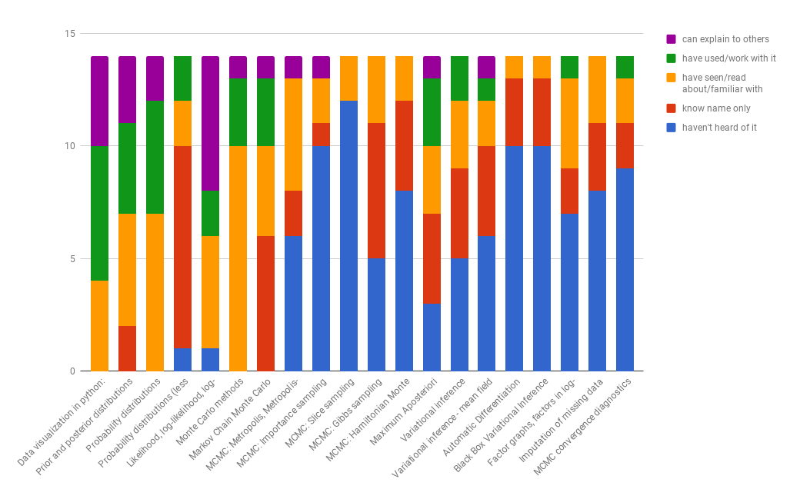

# Tutorial: Probabilistic Programming using PyMC3 

Original repository: [PyMC3 DataScienceLA](https://github.com/fonnesbeck/PyMC3_DataScienceLA), modifications by CEAi.

The original material is taken from Chris Fonnesbeck's excellent repository for the DataScience LA tutorial.  Here this material is modified to prepare the ML team @ CEAi for the first Precision Workshop on Bayesian modelling.

Material from the PyMC3 introductory page is also added from the [getting started page](https://github.com/pymc-devs/pymc3/blob/master/docs/source/notebooks/getting_started.ipynb).

## TODO list

- [x] Measure initial skill level and knowledge state of group
- [ ] Work out speed and method of proceeding at group level
- [ ] Add more exercises and/or demonstrations where necessary
- [ ] Come up with a time plan targeting May for completion


## Initial group measurement

We polled the ML group in CEAi as to the actual state of knowledge (self-reported) of various topics stated below and the following stacked graph displays the result.



## Syllabus

The syllabus is modified with the following logic: first come segments which focus on basic usage patterns of PyMC3 and then on model building, using various more or less advanced tools such as custom factor potentials.  This first allows exploration of the expressive capability of Bayesian models and thus making clear the benefits thereof before diving into inference and finally model checking.  Model checking remains last as in original tutorial because it focuses on convergence analysis and goodness of fit, so an understanding of sampling and variational inference is necessary.


### Introduction to PyMC3

* Variable types
* Probability models
* Simple case studies

### Model Building with PyMC3

* Specifying priors and likelihoods
* Deterministic variables
* Factor potentials
* Custom variables
* Step methods
* Generalized linear models
* Missing Data


### Markov Chain Monte Carlo

* Metropolis sampling
* Gradient-based sampling methods

### Approximation Methods

* MAP
* Variational inference
* ADVI

### Model Checking and Output Processing

* Storage backends
* Convergence diagnostics
* Goodness of fit
* Plotting and summarization


## Software Installation

Running PyMC3 requires a working Python interpreter, either version 2.7 (or more recent) or 3.4 (or more recent); we recommend that new users install version 3.5 (but see special note below if you are a Windows user). A complete Python installation for Mac OSX, Linux and Windows can most easily be obtained by downloading and installing the free [`Anaconda Python Distribution`](https://www.continuum.io/downloads) by ContinuumIO. 

`PyMC3` can be installed using `conda`, a package management tool that is bundled with Anaconda. PyMC3 also depends on several third-party Python packages which will be automatically installed when installing via `conda`. The four required dependencies are: `Theano`, `NumPy`, `SciPy`, `Matplotlib`, and `joblib`. To take full advantage of PyMC3, the optional dependencies `seaborn`, `pandas` and `Patsy` should also be installed. You can install PyMC3 and its dependencies by cloning this repository:

```
git clone https://github.com/oapio/PrecisionWorkshop1_Prep
``

Then move into the directory created by the clone, and install the required packages using `conda`:

```bash
cd PyMC3_DataScienceLA
conda env create -f environment.yml
```

This will create a *virtual environment* called `pymc_tutorial` that includes the dependencies for PyMC3 that is completely separate from any other Python installations you may have on your machine. To activate this environment to run the course materials, you can run the following command from the terminal:

```bash
source activate pymc_tutorial
```

**If you would rather not install the software yourself, you can use the MyBinder.org link at the top of the page to run the course materials on a remote server**
